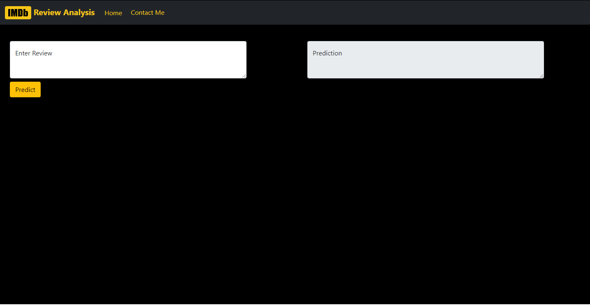

# IMDB-Review-Analyser

I have made this Project to classify **Movie Reviews** \
The Reviews gets classified into two classes: *postive* and *negative* \
Deployed on Heroku: https://imdb-review-analyzer.herokuapp.com/
<br><br>

## Screenshot<br>



<br>

## Features

- Predicts with 89% Accuracy
- Responsive Web App
- Logs each action
- Supports Every Operating System
- Computer Generated Email Functionality

<br>

## Tech Stack

**Client:** HTML, CSS and Bootstrap

**Server:** Python

<br>

## Installation

Install dependencies for the project using _**pip**_

```bash
    cd <project-folder>
    pip install -r requirements.txt
```
<br>

## Deployment

Project can be deployled on Heroku

```bash
  git add .
  git commit -m <message>
  git push heroku main
```
Refer to the official documentation for more details: https://devcenter.heroku.com/articles/getting-started-with-python

<br>  

## License

[MIT](https://choosealicense.com/licenses/mit/)
<br>
  
## Author

[@Rishabh1501](https://github.com/Rishabh1501)
<br>

## Support

For support, email at rishabhkalra1501@gmail.com 

  
